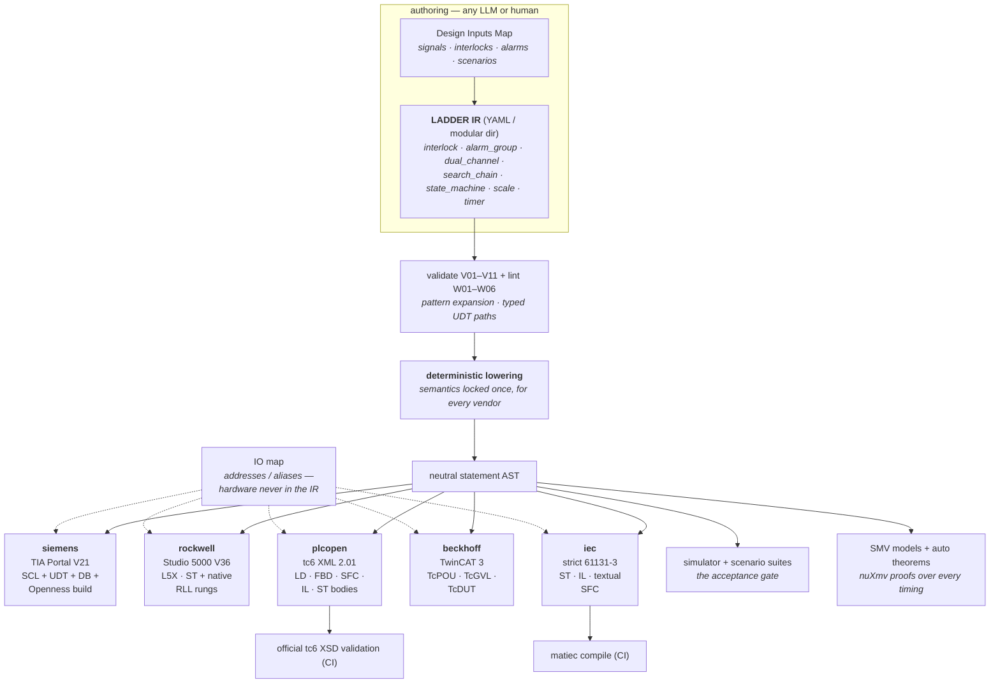

# LADDER

**L**LM-**A**ssisted **D**esign & **D**eployment of **E**ngineering **R**outines —
vendor-agnostic PLC program generation from a declarative, verifiable design.

**LADDER separates what must be deterministic from what benefits from
intelligence.** The core — validation, lowering, simulation, formal proof,
vendor builds — is deterministic, LLM-free code, forever; that is what makes
the rest safe. On top of it, production projects come together as a **loop**:
an assistant (any LLM, hosted or local — the contract is plain JSON Schema +
YAML) drafts the design map, IR, and scenarios; the machine judges every
draft with the same gates a human's edit would face; the human provides the
ground truth only they have (signals and their senses, safety philosophy,
acceptance stories, hardware reality) and signs off at defined review gates.
An expert can still author every line by hand — same gates, no assistant.
The split of who provides what is spelled out in
[docs/WORKFLOW.md](docs/WORKFLOW.md); `ladder prompt --intake` turns any
chat model into the guided interviewer.



The point: the model never writes vendor syntax. It selects patterns and fills
in parameters against one well-specified schema — a small, constrained,
checkable generation problem — while everything vendor-quirky lives in
deterministic code.

## Where to start

New here → **[Getting started](docs/GETTING-STARTED.md)** (10 minutes).
Building something real → **[the tutorial](docs/TUTORIAL.md)**.
Mid-task question → **[the guide](docs/GUIDE.md)**.
Full reference → **[docs/](docs/README.md)**.

## Quick start

```powershell
python -m venv .venv
.venv\Scripts\python -m pip install -e .[dev]

.venv\Scripts\ladder init C:\work\my-plant   # scaffold a user project (own repo)
.venv\Scripts\ladder check C:\work\my-plant  # its full acceptance gate
.venv\Scripts\ladder docs  C:\work\my-plant  # generate its documentation package

.venv\Scripts\ladder validate examples\vacuum_interlock.yaml
.venv\Scripts\ladder build examples\vacuum_interlock.yaml -t all -o out
.venv\Scripts\ladder verify examples\vacuum_interlock.yaml -t iec   # matiec, vendor-free
.venv\Scripts\ladder schema -o ir-schema.json    # the LLM contract
.venv\Scripts\ladder targets
.venv\Scripts\python -m pytest
```

## What the IR expresses (v0.1)

Declarative logic elements, not rungs: `interlock` (fail-safe, latching with
manual reset), `alarm` (on-delay, latching with ack, severity), `timer`
(TON/TOF/TP), `state_machine` (lowered to CASE), `assign`, and `st` (neutral
Structured Text escape hatch). Full reference: [docs/IR-SPEC.md](docs/IR-SPEC.md).

Semantics (what "latching interlock" *means*) are locked in
`src/ladder/ir/lower.py`, once, for every vendor — backends only render.

## Layout

```
src/ladder/ir/          IR: pydantic model, expression language, semantic
                        validation (V01–V08), lowering to statement AST
src/ladder/backends/    dialects.py (ST dialect renderers) + one module
                        per vendor; register via backends/base.py
src/ladder/patterns/    parameterized IR fragments (grows from mined
                        reference programs)
examples/               IR documents
docs/                   IR spec, roadmap
```

## Vendor engines vs. backends

Backends (this repo, today) **generate artifacts**. Engines (next phase)
**drive vendor tools** to import/compile/deploy them and adopt real project
structure:

- **Siemens** — delegates to the validated
  [TIA_API / TiaOpenness](../TIA_API/README.md) PowerShell module
  (Openness, V21). `build.ps1` emitted per project is the seam. Project
  structure will be reverse-engineered from the reviewed reference TIA program.
- **Rockwell** — L5X imports directly into Studio 5000 V36; the Logix Designer
  SDK is the automation path. Structure to be reverse-engineered from the
  reference Studio 5000 program.
- **Beckhoff / PLCopen** — native items / tc6 XML; Automation Interface later.

## Status

| Piece | State |
|---|---|
| IR model + JSON Schema export | ✅ v0.1 |
| Expression language (neutral ST subset, parsed AST) | ✅ |
| Semantic validation (identifiers, resolution, fail-safe rules) | ✅ V01–V08 |
| Lowering (interlock/alarm/timer/state machine semantics) | ✅ |
| Backends: siemens / rockwell / plcopen / beckhoff / iec | ✅ artifacts emit, tests green |
| `ladder verify` + vendor-free CI (matiec checks emitted IEC ST) | ✅ |
| **Live TIA build: portal → project → CPU → tags → SCL → compile** | ✅ **0 errors on V19** (V21 SCL import needs a STEP 7 license — see AGENTS.md) |
| Reverse adoption: `ladder adopt siemens` (Export-TiaToSpec → IR) | ✅ round-trip proven: IR → SCL → TIA → SimaticML → IR |
| Simulator (`ladder.sim`): scan-based interpreter, real timer semantics | ✅ scenario tests pin interlock/alarm/state-machine behavior |
| Pattern invocation (`element: pattern` → expansion before validation) | ✅ `motor_starter`, `valve_with_feedback`; see [examples/pump_skid.yaml](examples/pump_skid.yaml) |
| Static lint W01–W05 (unused/multi-written tags, SM reachability) | ✅ surfaced by `ladder validate` |
| `ladder prompt` — model-agnostic generation bundle for any LLM | ✅ schema + rules + patterns in one paste-able doc |
| `ladder test` — declarative acceptance scenarios in the simulator | ✅ [docs/SCENARIOS.md](docs/SCENARIOS.md) |
| `ladder generate` — full loop: any LLM → validate → feedback → accept | ✅ provider-neutral (stdin/stdout shell contract) |
| [Benchmark](benchmarks/README.md): spec → IR tasks, simulation-scored | ✅ 3 tasks with CI-verified references; `ladder bench` scores any model |
| `scale` element — analog raw→EU scaling with per-dialect conversion | ✅ |
| **Formal verification**: `ladder model` → SMV + auto fail-safe theorems, proved by nuXmv | ✅ interlock permits proved safe over *all* timings |
| **IR v0.2**: UDTs + arrays (typed member/index validation V10) | ✅ Siemens global DB **live-compiled 0 errors**; Logix UDT w/ BIT packing; STRUCT/DUT elsewhere |
| IO maps (`--iomap`): hardware bindings outside the IR | ✅ Siemens addresses, Logix alias tags, TwinCAT/IEC located vars |
| `alarm_group` — annunciator with common ack, horn, first-out capture | ✅ semantics scenario-pinned; horn/first-out theorems proved by nuXmv |
| **All five IEC 61131-3 languages** (`language:` per program) | ✅ ST everywhere; IL (matiec-proved); LD → Rockwell RLL + PLCopen; FBD/SFC → PLCopen; tc6-XSD-validated in CI |
| Safety elements: `dual_channel` (1oo2 + discrepancy), `search_chain` (PPS area search) | ✅ semantics from a reviewed reference PPS; auto-theorems proved by nuXmv (UDT members supported) |
| **Modular IR**: `ir/` directory (project/types/tags/programs per file) | ✅ filename order = scan order; large projects split into reviewable sections |
| `ladder docs` — the generated documentation package | ✅ requirements, software spec, conventions, developer + operator manuals, verification report |
| **`pid`** element (clamping anti-windup, bumpless enable) + closed-loop scenario testing via `model:` plant steps + `expect_near` | ✅ PID converges to setpoint against a first-order plant, in pure YAML |
| `ladder render` — HTML logic report (rung art + scenarios + theorems) | ✅ the review artifact for people who don't read YAML |
| `ladder sim` — interactive scan-by-scan REPL | ✅ set/pulse/run/watch/state/model |
| `ladder mutate` — scenario-strength scoring by fault injection | ✅ scaffold starter kills 100% of mutants (pinned by test) |
| `ladder diff` — semantic IR diff in design language | ✅ permissives gained/DROPPED, scan-order warnings |
| `ladder doctor` / `ladder apply` / `ladder prompt --intake` | ✅ machine preflight; intake-loop paste-back; interviewer contract |
| Counterexample replay: violated theorem → runnable scenario | ✅ `verify -t smv` writes `*.replay.scenarios.yaml` |
| `ladder conformance` — corpus as the backend/plugin contract | ✅ all built-in backends pass |
| Reverse adoption: `ladder adopt rockwell <L5X>` | ✅ behavior-preserving round-trip proved in tests |
| `epics` backend — .db records + alarm list from the same IR | ✅ transport-agnostic macros |
| Self-contained projects: vendor/LADDER submodule + bootstrap + `requires:` gate | ✅ clone → bootstrap → green |
| Studio 5000 L5X automated import (Logix SDK 2.x) | ⬜ manual import verified; SDK not on this machine |
| TwinCAT reverse adoption (blark), Automation Interface driver | ⬜ roadmap — see [docs/ROADMAP.md](docs/ROADMAP.md) |

Agent/LLM working notes (tool-agnostic): [AGENTS.md](AGENTS.md).
Expert workflows as portable skills (intake → IR → vendor deploy → verify):
[skills/](skills/), built on the [Design Inputs Map](docs/DESIGN-INPUTS.md).
Plant logic lives in separate **user project** repos — `ladder init` +
`ladder check`, layout in [docs/PROJECT-LAYOUT.md](docs/PROJECT-LAYOUT.md).
