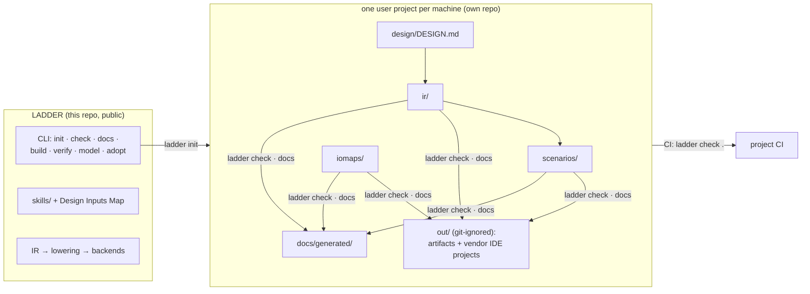

# User projects: how plant logic lives outside this repo

LADDER itself is a library + CLI. Real plant logic lives in **user
projects** — separate repositories that consume LADDER as a dependency,
one repo per machine/skid/system. This keeps facility-specific content
(and anything lab-internal) out of the open tool, and gives every plant
project its own history, review flow, and CI.



## Creating a project

```bash
pip install git+https://github.com/nusaqib/LADDER.git   # once, to get `ladder init`
ladder init my-plant          # or: ladder init my-plant --name MyPlant
cd my-plant && git init
tools/bootstrap.sh            # Windows: tools\bootstrap.ps1
.venv/bin/ladder check .
git add -A && git commit -m "scaffold"
```

**Every project is self-contained.** `bootstrap` pins the exact LADDER
toolchain as a git submodule at `vendor/LADDER` and installs it into a
project-local `.venv` — a fresh machine needs only git and Python
(`git clone --recursive`, run bootstrap, done; no separate LADDER
install, no PyPI). Two mechanisms keep the pin honest:

- the **submodule commit** records precisely which toolchain built the
  project — bumping it is a reviewed change, gated by `ladder check`;
- the manifest's **`requires:`** range (e.g. `">=0.2,<0.3"`) makes every
  `ladder` command refuse to run under a version the project wasn't
  built with, so a stray system-wide install can't silently produce
  different artifacts.

`init` does not create empty files: it scaffolds a small but complete
**motor station** (fail-safe interlock, sealed-in start, latching
overload alarm) whose design map, IR, scenarios, and IO map are all
consistent — and whose `ladder check` passes immediately. Users replace
working content instead of inventing structure. Real content comes in
three ways — the first is the normal one ([WORKFLOW](WORKFLOW.md)):

1. **The LLM-driven loop (recommended)** — `ladder prompt --intake`
   turns any chat model into the interviewer: it asks you for the
   ground truth only you have, drafts the design map, IR, and scenarios
   into these same slots, and `ladder check` judges every draft; you
   review the diffs and sign off at the gates. The `design-intake` and
   `ir-authoring` skills (LADDER repo, `skills/`) are the same loop for
   agent frameworks.
2. **By hand** — edit `design/DESIGN.md`, mirror it in `ir/`, keep
   `scenarios/` in sync. Same gates, no assistant.
3. **Adoption** — `ladder adopt siemens <spec>` from an existing TIA
   project, then move the emitted IR into `ir/` and write the map from it.

## The layout

```
my-plant/
├── ladder.yaml                    # manifest: what `ladder check` runs
├── design/DESIGN.md               # Design Inputs Map — the intake, edited FIRST
├── ir/<slug>.yaml                 # the IR: the only hand-written logic source
├── scenarios/<slug>.scenarios.yaml# acceptance behavior (definition of done)
├── iomaps/<slug>.iomap.yaml       # vendor addresses/aliases (never in the IR)
├── docs/generated/                # `ladder docs`: requirements → operator manual
├── vendor/LADDER                  # the pinned toolchain (git submodule)
├── tools/bootstrap.ps1 / .sh      # clone → working toolchain, one command
├── out/                           # generated artifacts — git-ignored, never edited
├── README.md / AGENTS.md / CLAUDE.md
└── .github/workflows/verify.yml   # CI: `ladder check .` on every push
```

### Modular IR (larger projects)

`ir:` in the manifest may point at a **directory** instead of one file —
sections split into files a reviewer can own separately:

```
ir/
├── project.yaml          # name, description, vendor hints
├── types.yaml            # UDTs        (or types/*.yaml fragments)
├── tags.yaml             # signal list (or tags/*.yaml fragments)
└── programs/
    ├── 10_inputs.yaml    # one program per file; filename order IS the
    ├── 20_protection.yaml#   scan/call order — number the prefixes
    └── 30_sequence.yaml
```

Hardware stays in `iomaps/` either way; generated projects emit this
layout from their generator (edit the generator, never the YAML).

Ordering rule that makes projects stay healthy: **design map → IR →
scenarios → check**. The map is the contract with the plant; the IR is
the contract with the tool; scenarios are the contract with reality.

## The manifest (`ladder.yaml`)

```yaml
project: MyPlant
requires: ">=0.2,<0.3"                # toolchain version gate
ir: ir/my_plant.yaml
scenarios: scenarios/my_plant.scenarios.yaml
iomap: iomaps/my_plant.iomap.yaml     # optional
targets: [iec, plcopen, siemens, rockwell, beckhoff]
out: out
```

```yaml
deploy: [siemens@21]                  # optional: vendor IDE projects
# deploy_script: tools/build_f.ps1    # optional: project-specific engine
```

`ladder check [dir]` reads it and runs the full acceptance gate:
validate + lint (V01–V11, W01–W06) → scenario simulation → artifact
build for every target (with the IO map applied). Exit code 0 means the
project is deployable-shape; project CI runs exactly this.

**`targets:` vs `deploy:` — two verbs on purpose.** Artifact builds are
portable: they run on any machine, including CI, with zero vendor
software. Materializing an **openable vendor IDE project** (a TIA
project, a Studio 5000 ACD) requires the licensed tool, minutes of wall
clock, and a specific machine — so it is a separate, explicit action:
`ladder deploy [dir]` runs the built-in per-vendor step for each
`deploy:` entry (siemens: the emitted build script at the pinned
`@version`; rockwell: SDK-driven when available, manual-import
instructions otherwise), or the project's own `deploy_script` when the
project ships its own engine. Which IDE projects a design produces is
therefore a reviewable line in the design spec, not a per-invocation
flag.

## Deployment from a project

- **Siemens**: `powershell -File out/siemens/build.ps1` (headless TIA
  compile; see the `siemens-deploy` skill). The **openable TIA project**
  lands at `out/siemens/project/<Name>/<Name>.ap<ver>` — a build artifact
  like everything else in `out/`: git-ignored, disposable, regenerated by
  every build, never hand-edited (edits there are lost on rebuild).
- **Rockwell**: import `out/rockwell/<Name>.L5X` into Studio 5000
  (see `rockwell-deploy`).
- **Vendor-free proof**: `ladder verify ir/<slug>.yaml -t iec -o out`
  (matiec), `-t smv` (nuXmv theorems) — same commands CI-able inside the
  project repo.

## One project, one IR document

A manifest names exactly one IR file; an IR document already holds many
programs (safety / alarms / sequences / drives), which is the right
granularity for one machine or skid. Plants with several independent
systems get several project repos — not one repo with many manifests.
