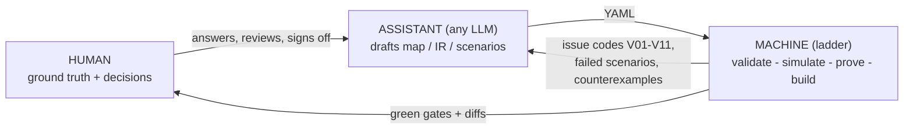

# The authoring loop — who provides what

LADDER separates what must be **deterministic** from what benefits from
**intelligence**. Getting that split right is the whole design:

- The **core is deterministic and LLM-free, forever**: validation,
  lowering, simulation, formal proof, artifact and vendor builds run as
  plain code with no model in the loop. This is not a fallback mode —
  it is what makes an LLM loop *safe*: every draft, whoever wrote it,
  meets the same machine gates.
- In practice, **production vendor projects come together as a loop**:
  an assistant drafts, the machine judges, the human decides. Writing
  IR by hand end-to-end is realistic for experts; the loop makes the
  same rigor accessible to everyone else without ever trusting the
  assistant.



## The segregation (memorize this table)

| | examples | why |
|---|---|---|
| **Human provides** (ground truth) | purpose and hazards; the signal list with BOOL senses; safety philosophy (what trips what, latching, reset ownership, redundancy); acceptance stories ("when X, the machine must Y"); hardware/vendor/tool versions; IO addresses | nobody else *can* — these facts live in the plant and in the engineer's head |
| **Assistant drafts** (always reviewed) | the filled Design Inputs Map; the IR; the scenario suite; doc polish | mechanical transcription of decisions into schema-valid YAML — exactly what LLMs are good at and diffs make reviewable |
| **Machine owns** (never the LLM) | validation + lint; lowering; simulation; SMV theorems and proofs; artifact/vendor builds; docs generation; toolchain pinning | must be reproducible, bit-identical, and auditable — a model in this layer would poison every guarantee downstream |

Hard rule the loop never breaks: **the assistant proposes, the machine
disposes, the human decides.** No generated change lands without the
gates green (`ladder check`) and a human reading the diff.

## Running the loop

**Interactive (any chat model)** — start from nothing:

```bash
ladder prompt --intake          # paste into any chat: it interviews YOU
```

The intake contract makes the model ask, one section at a time, for
exactly the ground-truth rows above — pushing on the classic field
errors (BOOL senses, latch/reset ownership, timing units) — then emit
the design map, IR, and scenarios as three fenced blocks. Save the
model's reply to a file and land it with one command:

```bash
ladder apply response.md .      # writes the blocks + runs the full gate
ladder render .                 # the human-readable review artifact
```

If the gate reports issue codes, paste them back to the model and
apply its revision — that *is* the loop.

**Single-shot with feedback** — you already have a requirement text:

```bash
ladder prompt "<requirement>" | <paste into any model>
ladder generate "<requirement>" --cmd "<llm-cli>" --accept scenarios.yaml
```

`generate` closes the loop mechanically: validator issue codes and your
scenario suite are the model's feedback until green or give-up.

**Manual** — edit `design/DESIGN.md`, mirror it into `ir/`, keep
`scenarios/` in the same commit, `ladder check .` until green. Same
gates, no assistant.

## Review gates (the human's job, kept small and sharp)

1. **Intake sign-off** — the design map says what you meant; every
   signal's sense is stated; every latch names its reset.
2. **Behavior sign-off** — scenarios read like the plant stories you
   told; they pass; add the story it *didn't* think of.
3. **Proof review** — the auto-theorems + your `given/always`
   properties prove; a counterexample is a design conversation, not an
   LLM retry.
4. **Deploy diff** — `out/` artifacts and the generated docs changed
   only where the design changed.

Everything else — schema shape, scan-order safety, vendor quirks,
address bookkeeping — is deliberately *not* the human's job.
